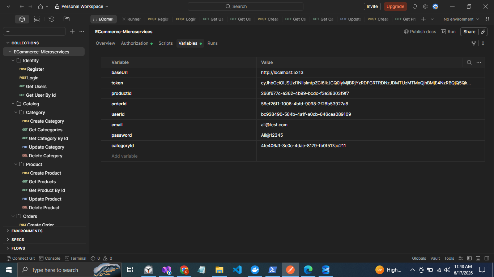

## API Documentation

### Postman Testing Workflow (Variables System)



### Postman Collection:
Postman collection is available in:
docs/postman/

Import the collection into Postman before testing APIs.

### Collection Variables
The collection uses Postman Collection Variables.
Variables are automatically stored during request execution and reused by subsequent requests.

### API Testing Order
#### Identity Service

1. Register User
The register request automatically stores:

- email
- password
- userId
in Collection Variables.

2. Login User
Uses:
    {{email}}
    {{password}}
from Collection Variables.

After successful login, the request automatically stores:
    {{token}}

3. Get User By Id
Uses:
    {{userId}}

4. Get Users

#### Catalog Service
5. Create Category
Automatically stores:
    {{categoryId}}

6. Get Categories

7. Get Category By Id
Uses:
    {{categoryId}}

8. Create Product
Uses:
    {{categoryId}}

Automatically stores:
    {{productId}}


9. Get Products

10. Get Product By Id
Uses:
    {{productId}}

11. Update Category
Uses: 
    {{categoryId}}


12. Update Product
Uses:
    {{productId}}

#### Order Service
13. Create Order
Uses:
    {{productId}}
Automatically stores:
    {{orderId}}

14. Get Order By Id
Uses:
    {{orderId}}

15. Delete Product
Uses:
    {{productId}}
Removes:
    {{productId}}
from Collection Variables.

16. Delete Category
Uses:
    {{categoryId}}
Removes:
    {{categoryId}}
from Collection Variables.

### Collection Variable Dependencies
The collection is designed to be executed sequentially.
Several requests depend on variables generated by previous requests:

    Register User
        ↓
    email
    password
    userId

    Login User
        ↓
    uses email + password
        ↓
    token

    Create Category
        ↓
    categoryId

    Create Product
        ↓
    uses categoryId
        ↓
    productId

    Create Order
        ↓
    uses productId
        ↓
    orderId


```text
Most request URLs and request bodies use Collection Variables such as:

-    {{baseUrl}}
-    {{token}}
-    {{userId}}
-    {{categoryId}}
-    {{productId}}
-    {{orderId}}
-    {{email}}
-    {{password}}
Therefore, requests should be executed in the documented order.
```

> Important:
> 
>     The Postman collection depends on successful execution of previous requests.

> If Order creation fails or asynchronous payment processing has not completed yet,subsequent requests may return unexpected or invalid results.

### For accurate testing:
1. Execute requests in the documented order.
2. Verify Order creation succeeds before proceeding.
3. Wait for payment events to be processed through RabbitMQ before checking final order status.
